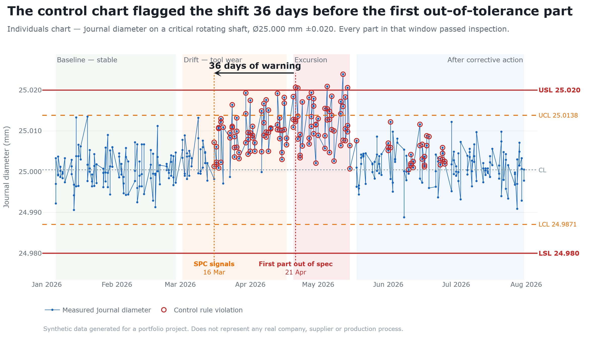

# Supplier Quality Engineering Control Tower

A portfolio engineering project applying practical quality engineering methods — SPC, process
capability, Pareto analysis, structured root-cause analysis and corrective action verification —
to a synthetic supply chain for a fictional high-performance powertrain programme.

> **All data in this project is synthetic.** It was generated from a statistical model with a fixed
> random seed. No supplier, component, measurement or non-conformance record here represents a real
> company, a real process or real production data.

---

## The headline finding

A critical journal diameter (25.000 mm ± 0.020) drifted upward over ten weeks as a finish turning
tool wore.

**The control chart signalled the shift on 16 March. The first part outside the drawing tolerance
was 21 April — 36 days later.**



For five weeks every shaft delivered was conforming and was correctly accepted at goods-in.
Inspection would have found nothing. That gap is the practical argument for monitoring a process
rather than only inspecting its output, and it is measured from the data rather than asserted.

*(Regenerate this chart with `python scripts/make_share_image.py`.)*

---

## Running it

```bash
pip install -r requirements.txt
streamlit run app.py
```

The dataset is committed, so the app runs immediately. To regenerate it (reproducible — fixed
seed):

```bash
python scripts/generate_data.py
```

To run the tests:

```bash
python -m pytest
```

66 tests covering data consistency, referential integrity, NCR workflow logic, and the statistical
calculations checked against hand-worked examples.

---

## What is in the application

| Section | Content |
|---|---|
| **Control Tower** | Headline KPIs, weekly trend, supplier and component overview, open NCR status |
| **Pareto Analysis** | Defect Pareto with cumulative line, severity cross-check, supplier/component drill-down |
| **Statistical Process Control** | I-MR chart with Western Electric run rules, selectable baseline period, control vs specification limits |
| **Process Capability** | Cp, Cpk, Cpu, Cpl, Pp, Ppk with histogram, normality test and per-phase breakdown |
| **Non-Conformance Reports** | 32 NCR records with full workflow status and linked corrective actions |
| **Root Cause Analysis** | 5 Whys and Ishikawa for two investigations, separating confirmed from potential causes |
| **Corrective Action** | 21 CAPA records with containment / corrective / preventive separated, and verification results |
| **Supplier Scorecard** | Five suppliers across eight measures, with named attention flags and no composite score |
| **Engineering Case Study** | One investigation end to end in nine steps, from detection to verified closure |

Every number on every page is calculated from the dataset at render time. Nothing is written into
the narrative text, so the commentary cannot drift away from the data behind it.

---

## The case study

The centrepiece. Nine steps, each a tab on the **Engineering Case Study** page.

| Step | Finding |
|---|---|
| 1. Detection | Defect activity concentrated on one supplier, one component, one defect category |
| 2. Pareto | At supply-base level dimensional deviation is **6th of 7** by frequency. The severity cross-check and narrowing to supplier/component is what surfaced it |
| 3. SPC | Sustained upward shift from 16 March. **36-day warning lead time** before the first out-of-spec part |
| 4. Capability | Cp held (1.49 → 1.17) while Cpk collapsed (1.46 → 0.47) — a centring problem, not a spread problem |
| 5. Investigation | Three NCRs in five weeks; the first raised against a *trend* before any part failed |
| 6. Root cause | An insert grade change released without re-validating tool life or reviewing the control plan |
| 7. Action | Containment, corrective and preventive action separated and each aimed at a different "why" |
| 8. Verification | Cpk 0.47 → 1.62, mean 12.0 → 1.7 microns off nominal, points beyond a control limit 30 → 0 |
| 9. Closure | Implemented 15 May, **closed 26 June** — the 42-day gap is the verification period |

### The part worth reading

An earlier investigation into the same trend (NCR-2026-014) stopped at the third why — "the
operator should adjust the tool offset more often". That action was implemented and **verified as
not effective**. The mean kept rising and parts went out of specification three weeks later, which
is why the investigation was reopened and taken deeper.

That failure is preserved deliberately. It is the clearest demonstration in the project of why the
verification step exists.

---

## Engineering decisions worth noting

Things that were chosen deliberately, with reasons:

- **I-MR chart**, because inspection produces one measurement per part and there are no rational
  subgroups to take a range within.
- **Sigma estimated from the moving range** (MR-bar / d₂), not the overall standard deviation. A
  drift inflates overall spread but not part-to-part range, so limits built from the range stay
  narrow and the drift walks outside them.
- **Control limits from a baseline period, held fixed.** Fitting them to all the data pulls the
  centre line from 25.00045 to 25.00405, makes the genuinely stable baseline trip run rules, and
  drops points beyond a control limit from 30 to 18. Demonstrated and tested.
- **Capability calculated per phase**, because averaging a capable process with an incapable one
  describes neither.
- **Verification against the excursion period**, not the whole pre-change period — averaging the
  stable baseline in would understate the problem and overstate the improvement.
- **Post-change data plotted against the original limits**, not limits recalculated from itself.
- **No composite supplier score.** Combining PPM, delivery and open actions into one number hides
  which is the problem and the weighting would be arbitrary. Notably, the case-study supplier sits
  *below* the PPM threshold and is flagged on repeat and critical NCRs instead.
- **A zero count is not a zero rate.** No out-of-spec parts in 154 after the fix, but the 95% upper
  confidence bound on the true rate is 1.93%, and the application says so.

---

## Project structure

```
├── app.py                      Streamlit entry point and sidebar
├── requirements.txt
├── pytest.ini
│
├── src/                        Core quality engineering logic
│   ├── config.py               Constants, SPC coefficients, phase windows
│   ├── data_loader.py          Loading, validation, filtering
│   ├── spc.py                  I-MR limits, Western Electric rules
│   ├── capability.py           Cp, Cpk, Pp, Ppk, normality, caveats
│   ├── quality_metrics.py      PPM, FPY, Pareto, scorecard, before/after
│   ├── investigations.py       Authored 5 Whys and fishbone content
│   └── charts.py               Plotly builders with a consistent visual language
│
├── views/                      One module per application section
│   ├── control_tower.py        pareto_view.py       spc_view.py
│   ├── capability_view.py      ncr_view.py          rca_view.py
│   ├── capa_view.py            scorecard_view.py    case_study_view.py
│   └── common.py
│
├── scripts/
│   ├── generate_data.py        Reproducible synthetic data generator
│   └── make_share_image.py     Regenerates the control chart image
│
├── data/                       suppliers, components, inspections, ncrs,
│                               corrective_actions  (CSV)
│
├── assets/
│   └── spc_control_chart.png   The chart shown above
│
├── tests/
│   ├── test_data.py            Consistency, referential integrity, workflow logic
│   └── test_quality_metrics.py Calculations vs hand-worked examples
│
└── docs/
    ├── engineering_case_study.md    Full write-up
    ├── hpp_quality_alignment.md     Method-to-theme mapping
    ├── cv_project_summary.md        CV wording and interview material
    └── future_improvements.md       Scoped-out ideas, with reasons
```

---

## Dataset

Generated with a fixed seed (`RANDOM_SEED = 2026`), reproducible, and internally consistent.

| File | Rows |
|---|---|
| `suppliers.csv` | 5 |
| `components.csv` | 6 |
| `inspections.csv` | 2,040 |
| `ncrs.csv` | 32 |
| `corrective_actions.csv` | 21 |

Overall: 51 non-conforming units in 2,040 inspected — 2.50%, 25,000 PPM, 97.50% first pass yield.
11 of the 32 NCRs are repeats.

**Internal consistency is enforced, not assumed.** A part is recorded as dimensionally
non-conforming *because* its measured value falls outside the specification limits. NCR workflow
states cannot describe an impossible sequence — an NCR cannot be closed without verification,
corrective action cannot precede a confirmed root cause, verification cannot precede a completed
action. All asserted in `tests/test_data.py`.

---

## Background reading

The quality engineering methods used here — SPC, capability, Pareto, root-cause analysis, CAPA —
are applied in the application and explained in
[`docs/engineering_case_study.md`](docs/engineering_case_study.md), which states the reasoning
behind each method choice and the limitations of each result.

Particular attention is given throughout to the distinctions that get confused: control limits vs
specification limits, Cp vs Cpk, defect vs non-conformance, containment vs corrective vs preventive
action, common vs special cause, verification vs validation, capability vs stability, and supplier
quality vs incoming inspection.

---

## Scope and limitations

Deliberately scoped. No machine learning, no prediction, no database, no API, no authentication —
none of it would strengthen the quality engineering evidence, and ideas that were considered and
excluded are recorded in [`docs/future_improvements.md`](docs/future_improvements.md).

Genuine limitations, stated in full in the case study write-up:

1. The data is synthetic, so the answer was designed to be findable. Real data is noisier and
   competing explanations are harder to eliminate.
2. **No measurement systems analysis.** The measurement branch was reasoned about and ruled out on
   the argument that gauge error would not produce a one-directional trend — a fair argument, but
   not the same as a Gauge R&R. On a 12-micron drift against a 40-micron tolerance, measurement
   variation could contribute. This is the clearest gap in the project.
3. One critical characteristic per component. Real parts carry dozens, and choosing which matter is
   itself a quality engineering skill.
4. Defect rates are higher than a mature programme would accept, chosen so the analysis has
   something to work with.
5. Eleven weeks is a short verification window — persuasive, but not long enough to show the control
   holds through a tooling change or a new material batch.
6. Thresholds (25,000 PPM, 92% OTD) are project conventions. In practice they come from the quality
   agreement with each supplier.

---

## About

Built by a second-year BEng Aerospace Engineering student at UWE Bristol as a portfolio project,
to demonstrate quality engineering reasoning rather than software complexity.

It is evidence of understanding the methods and being able to apply them. It is not professional
quality engineering experience, and it does not claim to be.
